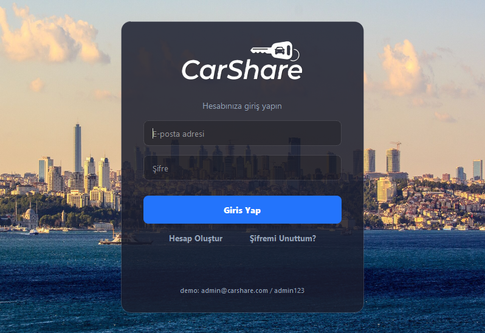
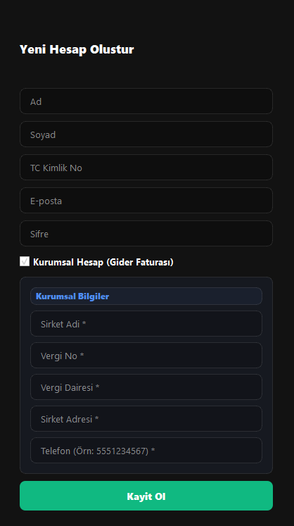
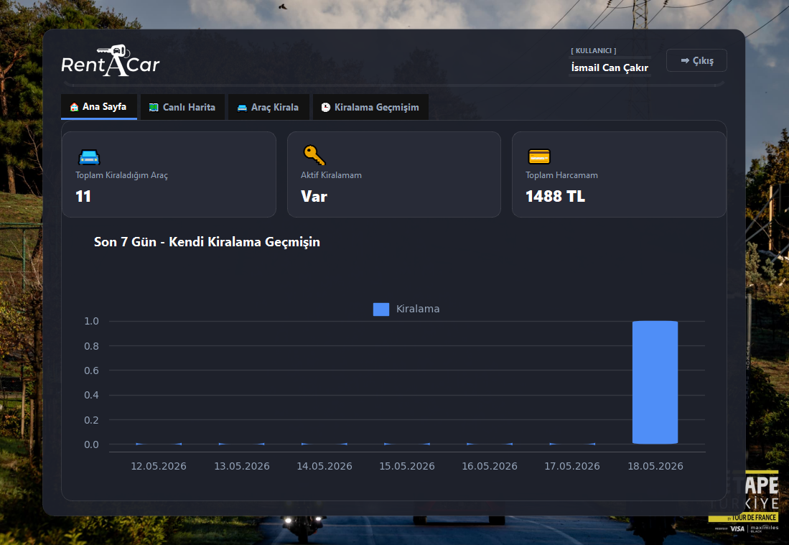
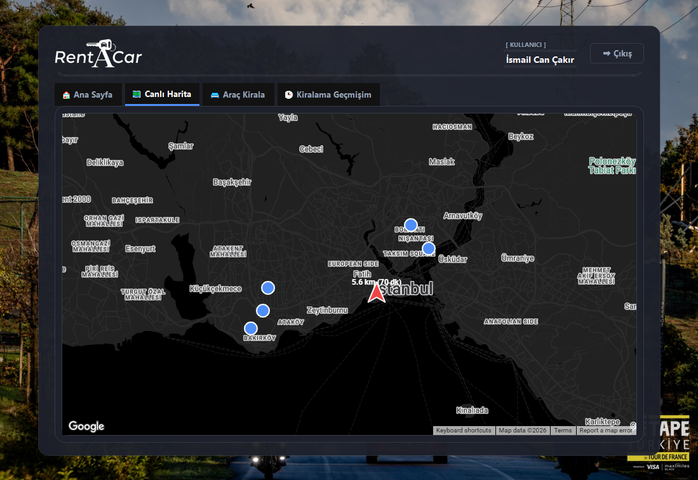
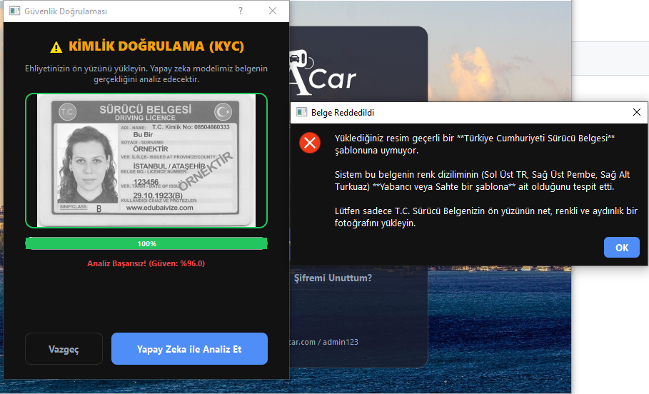
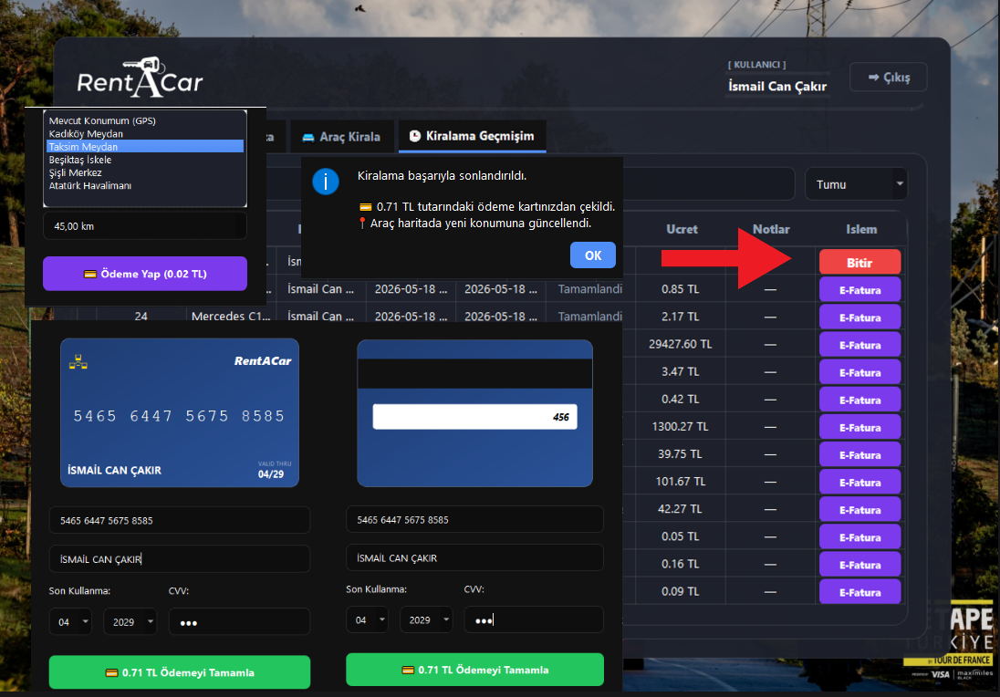
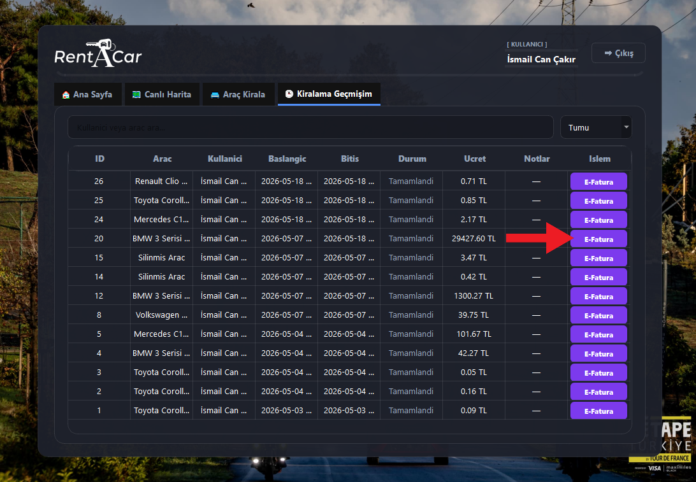
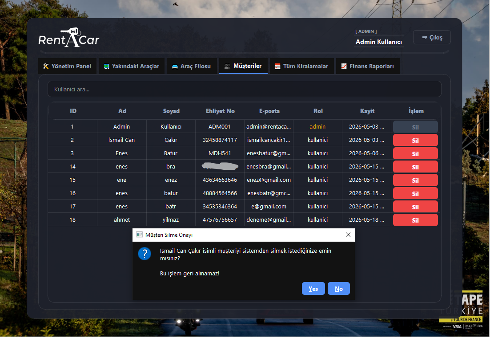
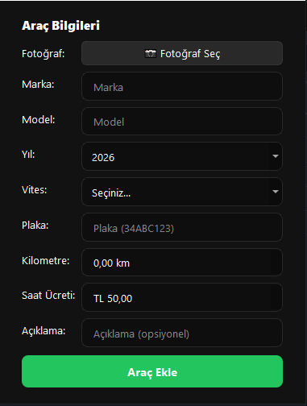
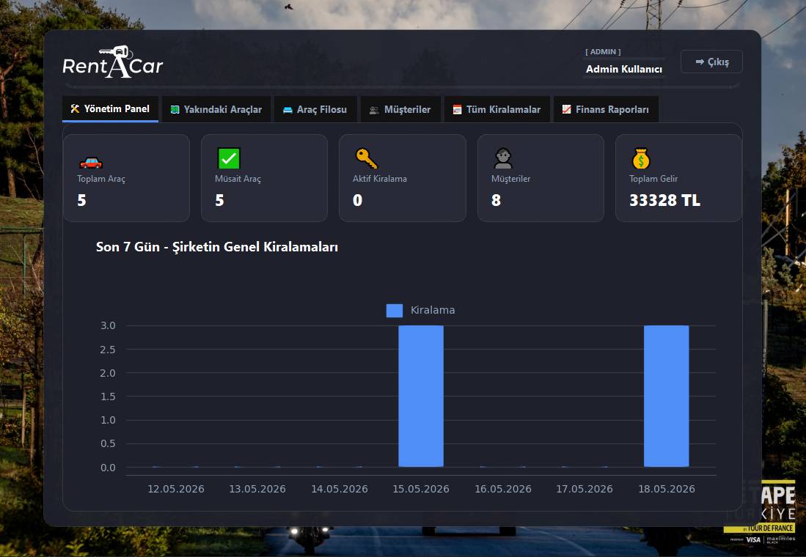

# 🚀 RentACar Araç Paylaşım Sistemi Genel Bakış

1. Giriş ve Hesap Oluşturma Ekranları
Kullanıcıların güvenli giriş yaptığı ve RegEx kısıtlamalı (E-posta doğrulama, otomatik küçük harfe çevirme, telefon hane kontrolü) kayıt modülü.

2. Müşteri Ana Sayfası ve Araç Seçim Ekranı
"Apple Store" sadeliğinde tasarlanmış, mevcut müsait araçların listelendiği şık Dashboard.

3. Canlı Harita Modülü
Araçların gerçek konumlarının Leaflet API ve OpenStreetMap yardımıyla QWebEngineView üzerinde gösterildiği ve haritadan doğrudan kiralama tetiklenen ekran.

4. Ehliyet Yükleme ve Yapay Zeka Doğrulama Ekranı (KYC)
4-Nokta DNA renk taraması algoritmasının sahte ve yabancı belgeleri yakaladığı, kriz kontrol ekranı.

5. Aktif Kiralama, Ödeme ve Geçmiş İşlemler Ekranı
Sanal kart arayüzü barındıran ödeme ekranı ve tamamlanan işlemler sonrası PDF fatura üretim modülü.

6. Admin Paneli - Müşteri Yönetimi ve Kullanıcı Silme Ekranı
Sistem yöneticisinin üyeleri izlediği ve yüksek güvenlikli yönetim sekmesi.

7. Admin Paneli - Araç Filosu Yönetimi
Marka ve model hanelerine özel karakter girilmesini engelleyen RegEx mimarili araç ekleme, çıkarma ve fiyat güncelleme ekranı.

8. Admin Paneli - Finansal Analitik ve Grafikler
Şirketin toplam kazanç, popüler araç ve kiralama istatistiklerini grafiksel olarak gösteren analiz paneli.

